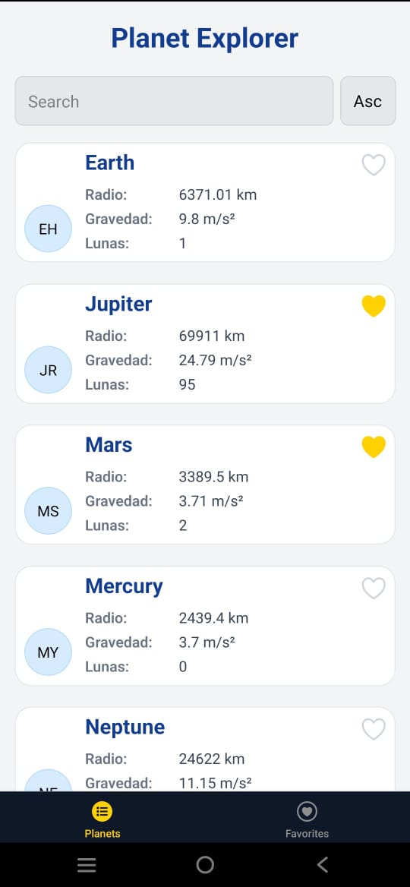
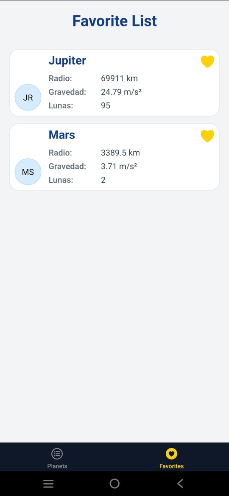
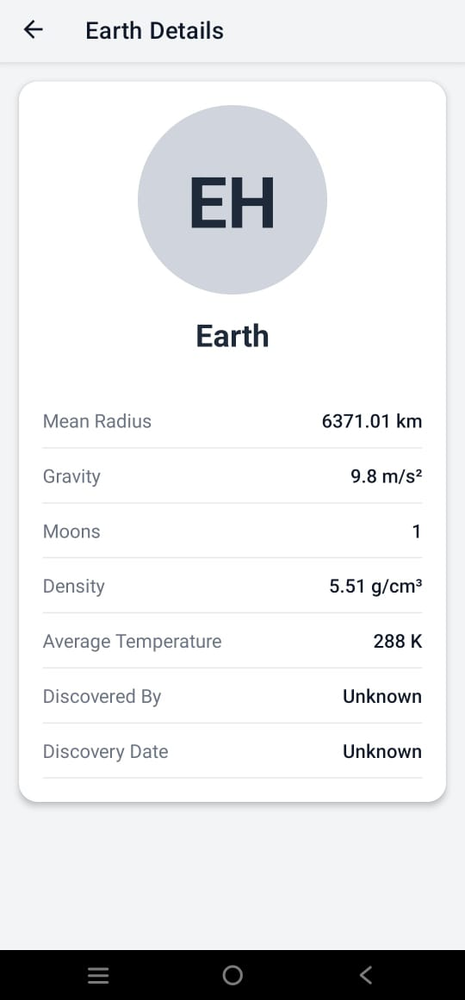

# Planet Explorer App

Plane tExplorer is a modern mobile application built with React Native and Expo, designed to explore and discover information about planets and celestial bodies.

## 🚀 Technical Stack

### Core Technologies

- **React Native**: Version 0.76.9
- **Expo**: Version 52.0.46
- **TypeScript**: Version 5.3.3
- **React**: Version 18.3.1

### Key Dependencies

- **Expo Router**: For file-based routing
- **React Query**: For data fetching and state management
- **Axios**: For HTTP requests
- **Async Storage**: For local data persistence
- **Reanimated**: For smooth animations

## Technical decisions

- Expo was used for development as it allows me to quickly create apps with React Native without many configuration complications.

- Expo Router was chosen, as it is a library that enables easy, scalable, and universal app-level navigation [iOS, Android, web].

- Clean architecture is implemented.

- Containers and component presentation are implemented.

## 🏗️ Project Structure

```
├── app/                 # Main application routes and screens
├── components/          # Reusable UI components
├── constants/           # Application constants and configurations
├── providers/           # Context providers and global state
├── services/            # API services and external integrations
├── types/               # TypeScript type definitions
├── adapters/            # Data adapters and transformers
├── lib/                 # Utility functions and helpers
├── assets/              # Static assets (images, fonts, etc.)
└── hooks/               # Custom React hooks
```

## 🛠️ Development Setup

### Prerequisites

- Node.js (LTS version recommended)
- npm or yarn
- Expo CLI
- iOS Simulator (for Mac) or Android Studio (for Android development)

### Installation

1. Clone the repository:

```bash
git clone [repository-url]
```

2. Install dependencies:

```bash
npm install
# or
yarn install
```

3. Start the development server:

```bash
npx expo start
# or
npm start
# or
yarn start
```

### Available Scripts

- `npm start`: Start the Expo development server
- `npm run android`: Run on Android device/emulator
- `npm run ios`: Run on iOS simulator
- `npm run web`: Run on web browser
- `npm test`: Run tests
- `npm run lint`: Run linter

## 📱 Features

- Modern and responsive UI
- Smooth animations and transitions
- Efficient data fetching with React Query
- Type-safe development with TypeScript
- Cross-platform compatibility (iOS, Android, Web)

## 🔧 Technical Decisions

### Architecture

- **File-based Routing**: Using Expo Router for intuitive navigation
- **Component-based Architecture**: Following React best practices
- **Type Safety**: Full TypeScript implementation for better code quality
- **State Management**: Using React Query for server state and Context API for global state

### Performance

- **Optimized Assets**: Properly sized and compressed images
- **Efficient Data Fetching**: Using React Query for caching and background updates

### Development Experience

- **TypeScript**: For better developer experience and code quality
- **ESLint**: For code style consistency
- **Jest**: For testing
- **Expo**: For simplified development and deployment

## 📦 Deployment

The application can be built and deployed using Expo's build system:

```bash
expo build:android
# or
expo build:ios
```

This command will move the starter code to the **app-example** directory and create a blank **app** directory where you can start developing.

## Install Android APK

```bash
https://expo.dev/accounts/seft/projects/PlanetExplorer/builds/892d3d24-fdf8-4116-9cd5-ca3823709523
```

## Preview

#### Home Screen



#### Favorite Screen



#### Planet Details Screen


